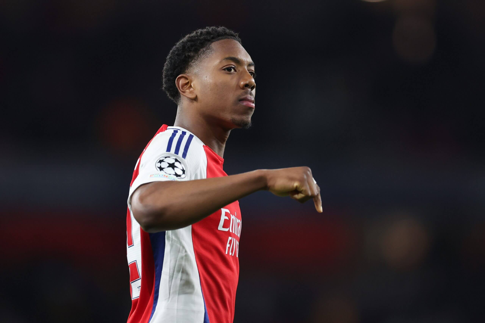
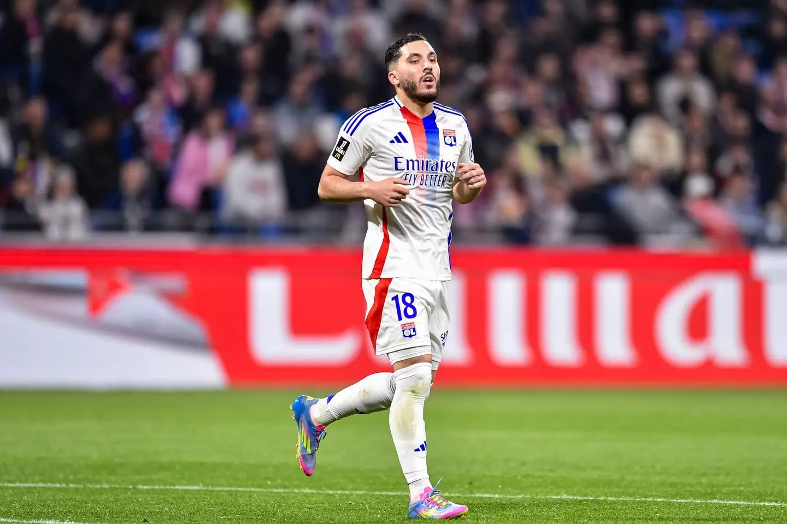
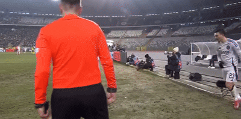

# Wonderkids of the week 2025:

Every week, I will choose a young player in the football scene to
highlight based on their performance in that week. I will try and
highlight different players from different leagues, positions, and
countries.

#### Last update: May 25th, 2025\* Updated ALL radar charts with updated full season data!

## Week of May 19th to May 25th: Brajan Gruda: Attacker, Brighton

#### Stats: 73 minutes, 1 assist, 5 chances created, 1 BCM, 2 Shots on target, 4 recoveries, 4/5 duels won in 3-2 win vs Liverpool

Brajan Gruda played an instrumental role in Brighton’s 3-2 win vs
premier league champions Liverpool on Monday, May 19th. The German was
involved in nearly everything positive about their attack and linkup
play. Gruda usually lines up as a right winger for the Seagulls but
today he was deployed in a much more central position that appeared to
suit him quite well. He has the technical elegance to turn and looks
right at home in the tight spaces between the lines. His dribbling
created space for teammates and drew in defenders that did not want any
part of trying to tackle him. The 20 year old came over from Mainz last
summer and has been on the fringes of the squad, often being used as a
substitute, but is maybe finding his groove here as the season winds
down. He is most certainly a player to watch out for next season.

Gruda’s stats are based on a sample size of only 611 minutes, so it’s
important to take them with a grain of salt. He’s accumulated these
stats over the course of 21 games this season, with a lot of those being
substitute appearances with limited minutes That being said, he
currently ranks quite well in assists per 90, tackles per 90, and shot
creating actions per 90, which is understandable watching him play.
Usually deployed off the right wing, Gruda is one of those players who
glides with with the ball, looking to come inside onto his favored left
foot. However, he often begins to come inside further back and attack
the half space to create for his team, rather than a more traditional
winger looking to cut in and shoot near the box. That being said, he is
not afraid to use his right foot and drive the defense back. I
personally love his skill set in the middle of the pitch as a 10. He’s
very comfortable on the turn and he’s great a manipulating passing lanes
and pulling the strings in attack, exactly what he did against
Liverpool. his assist was nothing short of brilliant, a quick-thinking
one touch pass over the top of the defense which was turned home by
Yasin Ayari.

He also showcased his ability in tight spaces, turning and attacking the
defense on his way to 5 chances created for his team, including this
wonderful layoff that really should’ve resulted in an assist.

As mentioned before, Gruda’s first season on the south coast of England
was a bit underwhelming as a whole, but at only 20 years old, he’s got
plenty of time to nail down a place in Brighton’s crowded team,
especially as they may lose some players in the summer. Make sure to
watch for Brajan Gruda next season as he may just be Brighton’s next
gem.

## \*Week of May 13th to May 18th: Marc Bernal: CDM Barcelona

#### Marc Bernal tore his ACL back in September, but without a real standout performer this week, I will highlight him before he comes back next season, as he impressed before his injury

The 2024/25 season was supposed to be Marc Bernal’s breakthrough year.
With Gavi and Frenkie De Jong out injured to start the year, Hansi Flick
trusted the 18 year old Bernal to start in midfield for Barcelona’s
first 3 league games. Had he himself not gotten injured at the end of
August, he most likely would’ve been a household name at this point. The
6’3” midfielder nonetheless put LaLiga on notice, providing a physical
element to Barcelona’s midfield of technicians, while also displaying
the technical prowess that we’ve come to expect from La Masia graduates.

Marc Bernal unfortunately only managed 272 minutes before his injury, so
it is not really worth looking at his stats. That being said, you can
really see his star quality when he’s on the pitch. Standing at 6’3”,
Bernal adds a physical presence to Barcelona’s midfield. He uses his
long legs to win duels against ball carriers, and is a great 1v1
defender at his young age. He can cover the width of the field and is
comfortable defending near the sideline, something that Barcelona need
with their high back-line and high pressure system. He’s also
comfortable defending deeper and dropping between the center backs if a
cross might come in or if the other team is sustaining pressure.

In possession, Bernal is very comfortable in the pocket just in front of
the defense. His skill-set and role are very similar to Arsenal’s Thomas
Partey. He’s comfortable receiving the ball on the turn and playing
incisive passes forward, or carrying the ball up the field. When
carrying the ball he’s got a great ability to use his long strides to
dangle the ball out in front of defenders, making them think they can
win it, before passing it off or touching it around them. When Barcelona
sustain possession higher up the pitch, he operates a little deeper,
often picking up the ball and switching the play with his passing range.

Barcelona definitely have another midfield gem in Marc Bernal. ACL
injuries are tough to come back from at any age, so I really hope he
comes the same player. Barcelona had an extremely successful season
dominating LaLiga, winning the Copa del Rey, and coming just a few
minutes away from making the UCL final, so breaking into that team would
be difficult for any player. That being said, manager Hansi Flick has
already proven that he trusts Marc Bernal, so keep an eye for him when
he returns from injury next year.

## Week of May 5th to May 12th: Franco Mastantuono: RW River Plate

#### Stats: 85 minutes, 1 goal, 2 chances created, 1 BCM, 3 shots on target, 12 recoveries, 8/17 ground duels, MOTM in 2-3 win at Barcelona SC

Franco Mastantuono has absolutely burst onto the scene this season at
just 17 years old. Joining the long list of Argentine talents right now
that includes the likes of Alvaro Montoro, Claudio Echeverri, Gianluca
Prestianni, and so many more, Mastantuono already has some of the
biggest clubs in Europe circling because of performances such as this
one. With 8 goal contributions in his 15 games this season, he’s been
tearing it up in the South American football landscape, but he provides
much more than just goals and assists. With a technical maturity well
beyond his years, Franco is showing Argentina that the reigning World
Cup champions’ future is in safe hands.

Mastanuono has played in 15 games so far this season, which is a decent
sample size considering most of them are starts. He ranks very highly in
a lot of areas, including the 99th percentile for shots on target and
successful take-ons, the 98th percentile for shot-creating actions, and
the 94th percentile for key passes. The one caveat to this data is that
it’s comparing him to the top 14 leagues outside of Europe’s top 5, so
essentially leagues 6-20. However, this may just indicate that he’s
ready to make the jump. At 17 years old, I would not expect him to be
the finished product, and watching him play he definitely has room to
grow. He’s deployed most often on off the right wing, but he drives
inside pretty early looking to create for is team.

Franco is 5’11” but plays bigger than that and uses his physicality to
his advantage when engaging in duels. I think he is probably better
suited in a more central role at the next level. He is a bit stiff in
his dribbling and isn’t comfortable on his weak foot, but the ball is
absolutely on a string when he’s got it, always ready to make a pass.
River Plate’s outside back likes to overlap, so he usually ends up a bit
more central anyway. In the box he likes to position himself near the
penalty spot, using the runs of other players a decoys and he sits in
the space waiting for a cutback. His preferred shot is the classic
curler to the far post, but he has success dragging it back to the near
post, and both are executed with great precision and technique. He shows
a lot of effort off the ball as well higher up the pitch, as his 12 ball
recoveries from this game would suggest.

It’s easy to see why Franco has taken over the South American
footballing scene. His combination of pace and power whilst dribbling,
as well as the technique he displays in passing and shooting is rare to
find in a 17 year old. The biggest clubs in Europe will be circling this
summer so he’s one to watch out for in the transfer market, but he may
stay in Argentina until he’s at least 18. I personally would love to see
him find a club that he can play at consistently, possible the likes of
Benfica or Sporting in Portugal, but he may be too big a talent to not
receive convincing interest from Europe’s elite.

## Week of April 28th to May 4th: Michael Kayode: RB Brentford

#### Stats: 81 minutes, 1 assist, 29/30 passes, 2 chances created, 1 BCM, 3 clearances, 2 interceptions, 7 recoveries, 9/14 duels won in 4-3 win vs Manchester United

The fifth defender and first right back to feature on this list, Michael
Kayode was a player that I personally did not know much about, but I
definitely know him now as should you. The 20 year old Italian is
currently on loan from Fiorentina and has played in 9 matches for the
bees, and has only made 3 starts largely due to a knee injury. His
performances have been great of late as he has helped Brentford win in
each of his first 3 starts. If he keeps playing like this, Brentford
will have no choice but to turn his loan deal into a permanent one, and
the rest of the premier league should be on notice.

There isn’t a whole lot that pops about Kayode’s stats this season, but
its another small sample size of around 770 minutes in all competitions
including the start of his season in Serie A for Fiorentina, their UECL
campaign, and his time at Brentford. His stats don’t necessarily
indicate any hallmark to his game, but the 89th percentile in
shot-creating actions may indicate he’s a player that likes to get
forward. This is further confirmed by his ranking in the 92nd percentile
for expected assists.

When analyzing Kayode’s game, the first thing that stands out
immediately is his superb athleticism. He’s 5’10” but looks larger on
the pitch due to his long legs and well filled out frame, both of which
he uses to his advantage in duels. He’s best described as your more
traditional fullback. He isn’t someone that is going to invert into
midfield and he’s not someone that you should really deploy as a
wingback in place of a winger. In Brentford’s back four, he excels at
dominating the right flank, making overlapping runs, crossing into the
box, and going toe-to-toe with the opposition’s left flank player. In
this game, he was responsible for United’s LWB, which I think he managed
quite well by staying a little wider when the ball wasn’t near him, and
putting pressure on immediately if the ball got switched. Defensively,
Kayode is very strong. He has the pace to keep up with wingers, and the
strength to knock them around. He is not easily bypassed one-vs-one.
He’s also got great anticipation, and uses his long frame to make good
interceptions

Offensively as you can see a little bit of it in that clip, Kayode loves
to get forward. If he has space in front of him, he’ll drive the ball
forward while dribbling featuring lengthy strides and not the best close
control. That being said, he is pretty tidy on the ball when it comes to
passing. Brentford’s right winger Bryan Mbeumo likes to move inside,
which leaves plenty of room for Kayode to overlap. You can see in the
clip below as soon as Mbeumo gets the ball he strides forward along the
touchline, and is ultimately rewarded for his efforts. His game also
features a long throw that helped create Brentford’s first goal.

Michael Kayode has proven to be yet another good value addition to
Brentford’s squad. With his combination of strength in defense, stamina,
and pace in attack, he has all the makings to be a dangerous player in
the future. Although he’s currently just on loan, don’t be surprised if
Brentford make the deal permanent. The premier league is sure to feature
some of the world’s best left wingers next season, but they’re going to
have their hands full with Michael Kayode next year.

## Week of April 21st to April 27th: Malick Fofana: LW Lyon

#### Stats: 86 minutes, 1 goal, 18/24 passes, 1 SOT, 3 recoveries, 4/6 duels won in 4-1 win vs Rennes

A young Belgian winger coming into his own in Ligue 1 should sound
familiar, but Malick Fofana has begun to write his own story this
season. Coming to Lyon by way of Gent 2 seasons ago, Fofana is
continuing to improve his game with each passing game, and he has been
brilliant for Lyon in their Europa league campaign. He grabbed his 9th
goal contribution in the league this weekend on top of his seven in the
Europa league this season. He’s become a mainstay for Lyon, appearing in
38 games for them this season so if you don’t know about him now, he’ll
make sure you do eventually.

Fofana’s stats may not immediately indicate a player with superstar
potential, but I am not all that surprised by them. He is very much a
touchline winger; he holds the width no matter where the ball is on the
field and most of the time when he gets it, he drives it forward into
space. This is shown by his ranking in the 98th percentile for
progressive carries. Wingers like this are not going to be responsible
for too many progressive passes. His role is to be a threat in
transition and keeping the pace of a counter attack, or operate in tight
spaces in more sustained possession. This becomes evident when watching
him play as Lyon like to get out in transition. His devastating pace and
close control is a nightmare for defenders retreating towards their own
goal they have almost no chance of stopping him. Physically he is quite
small, which he can use to maneuver in tight spaces, but he lacks
strength and balance to ride challenges. One major strength to his game
is his ability to use both feet. He plays off the left wing for Lyon and
he is left footed, but has no trouble cutting in on his right and
driving more centrally. In the clip below you can see what he’s about.
He picks it up in transition, carries the attacks pace as he drives
forward, before cutting inside and delivering a devastating finish on
his weaker right foot.

Defensively I don’t have much to write because Lyon doesn’t ask him to
do it much, as you an largely see by his stats. He has the energy and
tenacity to do so, but his 5’9” frame will limit his ceiling as a
defender. As it is he’s much better used as an outlet in transition.
There is more he can add to his game, mostly in the passing department.
He reminds me a lot of his compatriot Jeremy Doku. There can be no doubt
about his technical ability and his game-breaking 1v1 skills, but the
end product or the final pass just isn’t always there. However, that can
come with time and at just 20 years old, that’s something Fofana has
plenty of.

Malick Fofana is just getting started. In what has already been his most
prolific season yet, Fofana has certainly made a name for himself
amongst Europe’s elites. He has a ton of potential and this season he’s
done well to continue down the path of fulfilling it. While I don’t see
Fofana leaving France just yet, Lyon are in some financial trouble so
you never know what might happen. He’s certainly on Manchester United’s
radar after tearing up Old Trafford a few games ago, but as long as he
continues to improve, Fofana will have all of Europe on notice in no
time. Belgium’s golden generation may have all but aged out of their
chances at glory, but they have new blood scattered all across Europe
ready to takeover, and Malick Fofana is poised to be a key part of that.

## Week of April 14th to April 20th: Alvaro Carreras: LB Benfica

#### Stats: 90 minutes, 1 goal, 27/39 passes, 3/3 successful dribbles, 2 clearances, 2 recoveries, 8/14 duels won in 0-3 win at Vitoria de Guimaraes

Another gem playing in Benfica’s famous red and white, Alvaro Carreras
has had a true breakout year this year. The 22 year old has have a few
lukewarm loan spells, including one at Benfica last year. They chose to
make his loan a permanent transfer last summer, and it’s looking like it
will pay dividends. Not only is he delivering clutch performances like
this one down the stretch in what is yet another tight battle for the
Liga Portugal title, but he’s also found himself of the radar of clubs
such as Real Madrid who will come ready to pay up. Alvaro has quickly
found himself among the best young left backs in the world, and
Manchester United might end up ruing the day they let him go.

<figure>

<figcaption aria-hidden="true">Alvaro is very much an attacking
fullback. He does his defensive duties but when they are done, he is
looking to help his team get forward. He has great progressive passing
and carrying stats compared to other fullbacks. He has good physicality
for a fullback. He’s taller and a bit more wiry than he is strong, but
he does well in his duels. I think the first thing that stands about his
game is his dribbling ability. He’s not your classic marauding fullback
who needs space to take large touches into. He’s really light on his
feet and has great close control. He can sidestep defenders if he needs
to, and he dribbles in a way that invites defenders to try and win it
from him, only to be left behind as he goes around. He’s also pretty
comfortable in 1v1 scenarios in the attacking third as you can see for
his goal in this game.</figcaption>
</figure>

He’s a comfortable passer as well. It’s a great trait to have as a lot
of outside backs are easily pressed by the opposition, but he’s
comfortable on the ball and his light feet help him play quickly when he
is short on time and space, and has a decent enough weaker right foot.
He’s very good at picking out his teammates in the box with a cross,
most often on the ground. He’s got more finesse about his attacking game
than a classic fullback. Defensively he is no slouch either. He wants to
engage in duels, especially when the attacker receives it with their
back to goal. He can struggle a little when an attacker is able to face
him up and go 1v1, and he can be overzealous at times trying to win it
back, but that’s not uncommon among younger fullbacks. His lengthy 6’1”
frame helps him win the ball when others might not be able to reach, and
naturally helps him in the air.

Alvaro Carreras has all the makings to become one of the top left backs
in the world. A strong, lengthy defender combined with the technical
elegance one expects from the Spanish, many big clubs will be looking to
acquire Alvaro’s services. This season at Benfica has shown that he is
ready to fulfill his potential, so I wouldn’t be surprised to see him
wind up playing for one of the LaLiga giants next season.

## Week of April 7th to April 13th: Myles Lewis-Skelly: LB Arsenal

#### Stats: 90 minutes, 1 assist, 54/57 passes, 2 chances created, 2/2 tackles won, 4/7 duels won, 3 recoveries, 8 passes into final third in 3-0 win vs Real Madrid

One of the favorites for the golden boy award this year and one half of
Arsenal’s academy duo, 2025 has really been Myles Lewis-Skelly’s year.
The 18 year old broke into the team in December 2024 and has become a
mainstay in the team and is crucial to what they do. It’s not easy for a
player of any age to break into one of the best teams in Europe, but
that’s exactly what Myles has done. He brings a blend of strength and
power to the defensive line and when he inverts into midfield next to
Partey, the opposition has no chance. Certain were asking who he is at
the start of the season but they all know what he’s about.

<figure>

<figcaption aria-hidden="true">As an Arsenal fan, I’ve been waiting for
Myles’s breakthrough just as much as I was for Nwaneri. In his academy
days he was dominant at the base of midfield. His strength and
physicality was just too much for players at that level and he was known
for his marauding runs through the heart of the opposition. His skills
have translated perfectly, making those same runs for the first team at
the highest level. I changed a few of the statistical categories to
highlight some of the things that he is more responsible for in this
Arsenal team, because he is not a typical fullback and doesn’t play like
one. Myles is a natural midfielder, so when he’s at left back, he
inverts into midfield to give Arsenal more control. When this happens
and Arsenal lose the ball, he’s immediately out of position just by the
nature of what he’s being asked to do. His primary job is to then return
to his position as fast as possible, so he doesn’t make as many
interceptions or blocks or recoveries as your average left back. The
defensive work that he does do is often 1v1 with a winger in transition,
and that he does brilliantly, you can see highlighted by his 99th
percentile ranking in dribblers tackled percentage. In these duels he is
so strong for an 18 year old that he just muscles attackers off the
ball. He uses his body so well, always making sure he is between the
ball and his opponent so they cant get it and just often foul
him.</figcaption>
</figure>

As Arsenal try to control games, they do so from the midfield and Myles
has become an important part of that. He takes some of the weight off of
Partey’s shoulders and helps him by getting the ball from the defense on
the turn and playing forward. This is often done in tight spaces as the
opposition is pressing, which requires technical ability with both feet
and confidence, and Myles does not lack in either department. He’s got a
great eye for a pass as well when in the final third, as his 98th
percentile ranking in through balls suggests

Against a midfield of Camavinga, Bellingham, and Luke Modric, it was
Myles who shown brightest. There are not many players in the world that
can do what he does as confidently as he does, much less an 18 year old
kid. I could write a book on how good this kid is and how he is destined
for stardom. I think it is likely that his future lie in midfield, and
perhaps he takes over for Thoms Partey when his tenure at Arsenal is up,
and I think England would consider themselves lucky to have a midfield
of Declan Rice, Jude Bellingham, and Myles Lewis-Skelly. A goal in his
first game for England, and now a dominant performance against Real
Madrid, Myles Lewis-Skelly isn’t going away anytime soon. They may not
have known about him then, but they most certainly do now.

## Week of March 31st to April 6th: Alvaro Montoro: LW Velez Sarsfield

#### Stats: 23 minutes, 1 goal, 13/15 passes, 4/5 successful dribbles, 3 passes into final third, 2 recoveries, 4/7 duels won in 2-1 win over Peñarol in Copa Libertadores

Argentina is a hotbed for talented players right now, with Alvaro
Montoro being one of the headliners. Finally breaking us free of the
attacking midfielders, the 17 year old left winger is experiencing his
breakthrough season at Velez Sarsfield. This week he got his first taste
of Copa Libertadores action so what does he do? After being subbed on in
the 67th minute with his team down 1-0, he takes over the game and
casually bags the game winning goal in the 95th minute. A dominant cameo
with him pulling the strings from the left wing, Velez would’ve lost
that game if not for the trust they had in their 17 year old budding
superstar.

These stats portray Montoro as a pretty complete attacking profile. Now
he’s played just over 500 minutes so far this season, so it’s a small
sample size, but it’s still worth looking at. He’s got really great
rankings in successful take-ons, progressive passes, and somewhat more
surprisingly ball recoveries when compared with other wingers outside
Europe’s top 5 leagues. Montoro has a lot of game and is a very
intriguing left wing prospect. On the one had he does a lot of what you
would expect a young winger to do which is get the ball and try to beat
his man. He’s very good at it, using a superb blend of contact balance
and change of direction to leave defenders behind. He’s not the biggest
player but he has this ability to ride challenges and not go down while
also maintaining enough control to keep his dribble alive. He can also
stop on a dime and he likes to use hard cuts to send defenders the wrong
way.

However he’s not just a dribbler, but a passer as well. He likes to slow
some of his dribbles down and wait for the run of a teammate and looks
to play a pass. He has a wonderful outside of the foot pass in his
locker. He’s very right footed at this point in his development as a
player, which often leads to him directing his dribbles more centrally
rather than down the line. Defensively he will do his work higher up the
pitch, but he can be a bit shy in his duels and since he is so young,
physically he is not quite there yet.

To be this good at 17 years old is rare, but Alvaro Montoro is just
getting started. He’s becoming a key player for Velez Sarfield in his
first season, helping them top their Copa Libertadores group at the
moment. His potential is almost unlimited with his dribbling ability and
eye for a pass. He will surely begin to dominate the South American
football landscape before he gets his chance in the big leagues, but
that chance might come sooner rather than later if he continues to play
like he did this week. Alvaro Montoro is making a name for himself down
in South America, and it’s only a matter of time before his name is
known by football fans around the world.

## Week of March 24th to March 30th: Rodrigo Mora: CAM FC Porto

#### Stats: 86 minutes, 1 goal, 11/16 passes, 1 chance created, 6/11 duels won, 2 recoveries in 1-2 win at Estoril

The latest attacking gem out of Portugal hails from FC Porto’s academy.
Rodrigo Mora’s debut season at the age of 17 has been really bright,
notching 8 goal contributions in 16 appearances this season. He first
came on my radar last year as he was dominating at the u23 level. You
could so clearly tell that he was way above that level and ready for the
next step. Porto gave him a chance to make that step, and his transition
into first team action has been almost seamless. An elegant attacking
midfielder with an eye for a pass and a nose for the goal, Rodrigo
Mora’s future looks bright. He put in a big performance this weekend,
securing an important goal as his team battles to hold onto that third
spot in Liga Portugal.

There is not a lot that stands out about Mora’s core attacking stats.
Areas where he excels that are not included in this graphic include
goal-creating actions (94th percentile), tackles in the attacking third
(96th percentile), and touches in the attacking penalty area (92nd
percentile). These stats along with his impressive goals and assists
tally (98th percentile), this paints a pretty clear picture of his role
in Porto’s team. He plays very high up the pitch and is tasked with
providing the final action, which he’s done at a high level this year.
This isn’t an easy role for a 17 year old to adapt to, so it makes sense
why some of the other areas of his game appear lacking from a
statistical standpoint. He’s also moved around a lot for Porto, being
deployed on both wings and through the middle as an attacking mid. I
think he’s best somewhere in the middle of the field, but his abilities
allow him to be flexible in his positioning. Physically Mora is a
smaller player, listed at 5’6” with a thinner frame that causes him to
be less effective in defensive actions. Despite this, he’s good enough
at using his body positioning and strong legs to shield the ball well
enough when dribbling and being challenged, but this could be an issue
in a stronger league. What his frame does help with is his change of
direction. He loves a good fake shot/pass and quick turn to wriggle away
from defenders; He’s lighting quick in short bursts.

What stands out most to me is his poise. Mora plays with absolutely zero
fear despite the fact that he’s the smallest player on almost every
pitch, and he is always ready to have the ball. In midfield he’s
comfortable on the turn, out wide he wants to take his man on, but he’s
most impressive in the box. His comfort level with the ball in the
opponents box is amazing and allows him to pop up with so many goal
contributions. I mean just look at the goal he scored in this game: a
skillful pass to his teammate before getting the ball back, faking a
shot when everyone is expecting him to shoot, and roofing the ball with
his left foot, giving the goalie no chance.

He’s very rarely lose with a touch and mentally he operates at a higher
level than most players. Every touch is deliberate whether he’s working
an angle for a pass or setting up a feint for a defender to bite on,
both of which he does in the above clip. He is a good passer and
definitely has an eye for it. He sometimes tries to execute passes too
quickly which leads to some errors. He likes to invite defenders in
before making a quick pass for a “1-2” with his teammate. He also has a
great shot as he has 3.08 xG and 5 goals. As mentioned previously, his
poise in the box allows him to work good shots from tight areas. He also
has a great whipped shot from outside the box, and is very comfortable
shooting and passing with both feet.

Rodrigo Mora’s profile is very interesting. He draws comparisons to
David Silva with his minute size and his ability in tight spaces, but I
think he has the potential to be more of an Isco type of player,
providing kill shots via pass and shot with wonderful poise to coast
through and manipulate defenders. Either way, Mora’s ability sets him up
to be Porto’s next big thing and likely their next big sale. Perhaps
after another year in Portugal where he can really nail down his place
as one of Porto’s main men, he will be offered the chance to take the
next step by one of Europe’s giants. Nonetheless Rodrigo Mora has a
bright future in front of him, and his time to be one of Europe’s top
players will absolutely come.

## Week of March 17th to March 23rd: Konstantinos Karetsas: CAM Genk

#### Stats: 73 minutes, 1 goal, 18/19 passes, 1 chance created, 3 recoveries, 6/13 duels won in 0-3 win vs Scotland

The future of Greek football is in good hands. With many promising young
players coming through the ranks such as Charalampos Kostoulas and
Christos Mouzakitis, perhaps the most intriguing is Genk’s budding
superstar Konstantinos Karetsas. The thrid CAM in a row on this list,
Karetsas chose to play for Greece instead of Belgium this year and was
called up to the national team to play two games against Scotland. After
a bright cameo in the first matchup, the 17 year old started the second
matchup and grabbed his first goal for the Greek National team, making
him the youngest ever goalscorer for Greece. Karetsas has also been a
regular feature for Belgian side Genk this year. At only 17 years old,
this Greek wonderkid is proving to be not only a problem for the future,
but a problem for the present.

Karetsas’s statistics are very interesting as he ranks quite highly in a
lot of areas. These stats are calculated on a per 90 basis comparing him
to every attacker in leagues ranked 6-20. He looks to be very much a
creator. His job is to take risks and put his team in good spots to
score, a traditional number 10 if you will. As a result he ranks highly
in key passes, shot-creating actions, and progressive carries. The risks
he takes when dribbling and passing also result in a high number of
dispossessions (4th percentile), times tackled during a dribble (4th
percentile), and miscontrols (26th percentile). I am reminded of the
quote from Kevin De Bruyne while talking about pass accuracy where he
suggests that an attacking mid needs to take risks and thus can have
worse stats, but rankings this low will definitely need to be cleaned
up. It’s most likely that Karetsas is just a raw talent at the young age
of 17 and has been trusted with a difficult role, and I personally like
a player that is willing to take risks, and his risks pay off a lot of
the time. Karetsas is not the biggest player. He stands at 5’7” and has
a thin frame, but he has a wiry way about him. He’s not as easily
knocked off the ball as you might expect and he’s quite tenacious in his
duels.

Karetsas is definitely a finesse player and his style reminds me a lot
of Martin Ødegaard. He’s a little quicker and possibly takes more risks,
but they both generally look for the same space and use the same kind of
moves to manipulate defenders. He’s very left footed for now, and he
likes to operate in the sort of right half space between the lines. In
buildup he likes to turn and play it out wide, and in sustained
possession he almost always looks for a key pass or a way through the
defense on the dribble. From the right he’s got a wonderful in-swinging
cross and his passing in general is quite good, specifically the weight
of his passes is always very good. His dribbling is very good. He likes
to drive at defenders with pace and use a combination of feints and fake
passes to dupe defenders, before almost always going to his left foot.
He’s very comfortable on the ball in tight spaces, using some of
Ødegaard’s classic turns and pivots with his left. He has been playing
off the wing for Genk and has developed a lovely curled shot to the back
post, which he used in this game to grab his goal.

There are a couple of critiques to his game as I have touched on a bit.
For starters he’s very left-footed, so playing wing at a higher level
could be difficult. He also definitely does take too many risks as his
stats suggest. I’ve said that I like a player who is unafraid to take on
his man or play a tough pass that might lead to a shot, but Karetsas
risks often border on careless. Both of these flaws can be fixed and may
just come with time as he is only 17.

Konstantinos Karetsas is such an intriguing prospect. At just 17 years
old there is so much raw talent and ability in his game. Already scoring
a goal of such caliber for your country is very rare and shows that he’s
ready for the big stage. I think that he has more to prove at Genk
before he gets a big move, but this player is so talented that big clubs
will be calling soon. Karetsas has the world at his feet and if
continues on his current path, nothing will stop him from becoming one
of Europe’s elite footballers.

## Week of March 10th to March 16th: Diego Luna: CAM Real Salt Lake

#### Stats: 79 minutes, 1 goal, 28/36 passes, 1 chance created, 10 passes into final third, 2 recoveries, MOTM in 1-2 win at Houston Dynamo

The second CAM in a row on this list, Diego Luna has been flourishing in
his role as Real Salt Lake’s main man. At 21 years old, Luna has found
himself in the United States Men’s National Team rotation and as one of
the MLS’s brightest stars. The California native plays with a chip on
his shoulder, taking everything personally and making teams pay for it.
A true number 10 who floats across the pitch looking to unlock any
defense, Luna is an absolute joy to watch, and a name to keep an eye on

Luna has pretty good stats all around to start this season. If you are
not familiar with the MLS, their season started in February, so these
stats are subject to change as the season progresses, as he’s only a few
games in. Luna stands at 5’8”, so he’s pretty small but it does not
matter because he’s very strong. He has a unique stocky build that makes
it hard to win the ball from him as well as power through challenges and
tackles. Looking at his build and his features, it’s easy to mis-profile
Luna as a player. Although he makes the gritty plays, he’s more of a
finesse player than the brawler that he looks like. He floats across the
pitch like a true 10 trying to unlock the defense with a pass-and-move
style. He’s quick on the turn and loves to play in tight spaces because
he knows he’s better in their than other players. He’s also highly
intelligent; he doesn’t force himself into bad spots, but rather he
waits for the right moment to get involved, and always has a plan of
what he whats to do.

You can see a lot of his positive traits in this. Comfortable enough
along the sideline, he uses a quick burst to beat one defender and then
rides the challenge of another (though he does almost lose it). He
doesn’t quit on the play, and continues to pick up great space. He is
rewarded with the ball and he instantly takes a quick touch and a
quicker pass through the lines to create the chance from which Salt Lake
score their first goal. A brilliant piece of play that Luna was at the
heart of. He has great technical ability to pull the strings of Salt
Lake’s team. He’s clearly a level above the competition when you watch
him play, mostly on the mental side of the game. I think that the space
he picks up for his goal is brilliant. Even though this is probably a
misplaced shot, Luna is in a great spot for if his teammate had chosen
to pass, and he’s once again rewarded for his intelligent movement, this
time with a goal.

Luna’s got a strong shot too. He’s most often pulling the attacking
strings, but the chances he does get himself he takes well, mostly with
a powerful shot that he likes to keep low. There aren’t really any
glaring weaknesses to his game. In Real Salt Lake’s system, they don’t
press successfully too often, and they are probably a bottom 1/3rd club,
so he doesn’t get very involved in defense unless it’s in a very low
block. That being said, I think he has the capability to be an annoying,
tenacious defender in a different system.

Diego Luna may not be the prospect on this list with the highest
potential, but one thing is for certain: he will give 100% for his team.
He’s become a dominant figure in the MLS and looks every bit ready for a
step up. With many Americans scattered across Europe, it may be time for
Luna to make the jump. His technical ability and football IQ would make
him an asset for a lot of teams in Europe’s best leagues, and his
tenacity would give him an extra edge. Luna will have to stick to the
MLS for now, but this player has everything it takes to become a top
player at the highest level in the game.

## Week of March 3rd to March 9th: Rayan Cherki: CAM Lyon

#### Stats: 90 minutes, 2 assists, 48/56 passes, 6 chances created, 2 BCM, 2 recoveries in 1-3 win at FCSB. Also had a goal in substitute appearance in 0-2 win at Nice

It feels like the world has been waiting for Rayan Cherki to fulfill his
potential, and it’s finally happening this season. He made his debut at
just 16 years of age in October of 2019, and would become the youngest
goalscorer in Lyon’s history at 16. Football fans became entranced with
his technical ability and flair. Now at the age of 21, Cherki looks
poised to have his chance to takeover Europe. In terms of sheer
footballing ability, there are very few that can touch him right now.
Drifting across the pitch as Lyon give him license to do, he makes an
impact on nearly every game he plays in. Having matured enough after
playing years of first team football, Rayan Cherki might just be able to
bring the number 10 position back.

These stats come from a sufficient sample size and do a pretty good job
of portraying Cherki’s play style. He ranks ridiculously highly in
almost every attacking area. He’s in the 99th percentile for assists,
progressive passes, key passes, through balls, and shot creating
actions. 99th percentile. He is not a creative midfielder, he’s the
creative midfielder. He is basically positionless for Lyon, popping up
wherever he wants to on offense in order to have the largest impact on
the game. It allows him to get on the ball as much as possible, and look
to break down a defense. Cherki is 5’10” in height and is a pretty
sturdy build. He’s not going to wow you with pace, but his elegant style
means he doesn’t need to. He is not asked to do much defensive work in
this team, and I am not sure he would be too excited about it should a
team require him to do so in the future. There are rumors of attitude
problems, which definitely can happen to a player who has been told his
gifted for years, but I can’t speak to that and don’t want to speculate.

I love players like Cherki. He looks like he was born with a ball at his
feet, and born to play the game. He’s got a rare combination of
technical ability and football intelligence that all of the great
midfielders have. People often get hung up on the flashy skills and
flair, but that is just one part of making a play. You need to
understand the field of play, where players are and where the space will
be before you actually get the ball, and then you need a plan of what
you want to do with it, before you execute it. Rarely do players have
the ability to link these phases of play at a high level but Cherki has
it. He floats across the field gathering information and understanding
where the space is. When he does get the ball he understands what his
touches are doing to the opposition spacially, and he knows what he
wants to do with it in tight spaces. Just look at his first assist in
the game vs. FCSB.

When he gets the ball he knows he’s in a crowded area. Since he has just
come from the right side of the field, he instinctively believes there
will be space over there, so he turns and looks for a runner over to
that side. There is one, but the defender blocks it off. Because he’s
faked as if he’s going right, he cuts back, feeling as if there will now
be space on the left. He looks up and sees the numbers advantage on the
left and knows to release the pass. He gets a bit lucky, but it’s all
created by his instincts and awareness of the field around him. He’s one
of those players that lets the game come to him so he can understand it.
He doesn’t force his touches, but rather makes them count when he gets
them, and makes his movements deliberate. I’ve tried to highlight his
intelligence because if you follow football, you no doubt know about his
execution and technical ability. I still don’t know what is technically
his strong foot he’s so comfortable on both, and his shooting and
passing is just sublime in all aspects.

Rayan Cherki is an absolute gem. If you love football, then you’ll love
his game. Technical elegance with the intelligence to match, Cherki is
already one of Europe’s top creative talents. His role in Lyon’s team is
tailored to his abilities and style of play, something that benefits him
greatly. However with their financial issues they will be lucky if
Cherki is still there next year. Somehow he’s rumored to be available
for around 35 million euros, which big clubs should be all over. However
I do believe he needs to be in that free roaming 10 role to fully
maximize his abilities. Nonetheless, Cherki is one of the most exciting
talents in Europe, and is living up to the lofty expectations set on him
some 5 years ago as a 16 year old debutante.

## Week of 24th to March 2nd: Andrey Santos: CM Strasbourg

#### Stats: 90 minutes, 1 goal, 28/32 passes, 5 passes into final third, 4 recoveries, in 2-1 win over Lille

One of the brightest members of the Chelsea loan army, Andrey Santos is
captaining a young Strasbourg team to a historic season. the 21 year old
midfielder has had a true breakout season this year and looks like the
player Chelsea were hoping he would turn into when the plucked him out
of Brazil a few years ago. In his second loan spell at Strasbourg,
Santos has become a regular starter and captain for this young squad. A
box-to-box, duel winning midfielder mixed in with a little bit of skill
and Brazilian flair, Andrey Santos is making a name for himself in Ligue
1, and most likely preparing for a chance in the Premier League next
year.

Andrey Santos can truly do a little bit of everything. Most often
deployed as one half of a double pivot in midfield, Santos is committed
to the defensive side of the game. He rank very highly for tackles made
and ball recoveries. He’s added 7 goals and an assist so far this season
which is quite good for the deeper position that he plays. Physically
Andrey fits the profile. He’s 5’11” and is a healthy size. He’s very
strong in his duels and loves to make tackles. He has matured greatly in
this season, playing with a lot of confidence and a lot of poise. He has
taken the captaincy and embodies what it means on the pitch. Perhaps his
best defensive attribute is his timing. he’s not overzealous in his
challenges, but he waits for the right moment to step in. If an attacker
has their back turned, he puts pressure on immediately. He’s also good
at attacking opponents from their blind spot. If they are looking one
way or dribbling, he’ll sneak up on you and pluck the ball away, or be
ready if you turn and don’t know he’s there.

In possession, Santos has a tendency to play pretty deep. In buildup he
often assumes the role of a 6, receiving passes on the turn from
defenders and looking to play forward through a press. He’s strong to
hold the ball under pressure, and has a very comfortable turn. When
playing forward he has a good passing range and a good eye for a pass.
He’s very safe with the ball, not taking too many risks with his
passing, but has a good eye for a through ball either out wide or into
space for the striker. Further up the pitch he sits behind the offense,
providing an option as a layoff for his attackers. If he gets in in this
scenario, he’s good at playing quick, often one touch passes to a new
area of the field to relieve pressure.

Santos is a true box to box midfielder. He enjoys his defensive work,
but when it’s time to play offense, he get involved. He covers a lot of
ground and is involved in a lot of actions. He’s not the highest volume
passer, but he has the skills to get the job done. He also like to make
late runs into the box, ending up at the top of the box or the back
post, where he’s not afraid to shoot.

Andrey Santos has proven himself to be one of the top young midfielders
in the world today. His game has grown so much since he was at Vasco de
Gama in Brazil, and I think a lot of that has to do with his maturity
level. Playing first team football every week at the highest level has
benefited him greatly. Chelsea will no doubt be happy with his progress
and are set to reap the benefits, whether that be on the pitch or in the
market as they like to do, though I suspect that this will be a prospect
that they keep for themselves. With all of his talents combined with his
new and improved maturity and expereince, Santos is primed for a big
role in a top level midfield next season.

## Week of February 17th to February 23rd: Finn Jeltsch: CB VFB Stuttgart

#### Stats: 90 minutes (full debut), 52/59 passes, 2/2 tackles, 2 blocks, 2 clearances, 6 recoveries, 5/5 duels won in 1-1 draw at Hoffenheim

Considered one of the best young players in Germany, Finn Jeltsch is the
first true defender to make this list. Making his full Bundesliga debut
this week with his new club Stuttgart, Jeltsch impressed away from home.
He made a step up from second tier side FC Nürnburg in January, and he’s
now poised to help Stuttgart down the stretch, hoping to secure some
sort of European play next year. At only 18 years of age, to be playing
at the top level as a center back is no small feat.

Jeltsch’s stats might be a bit skewed because they mostly come from his
minutes in the second tier. However, they still paint a good picture of
the kind of center back he is. He ranks highly in tackles and
interceptions, as well as many passing related stats and carrying. This
suggests he’s one of the new age center backs who is good on the ball
and can be relied upon to move the ball around the field without giving
it away. His low ranking in clearances and aerials won is a bit
concerning, but often times with young center backs that have been tall
all their lives, they are not very good in the air right away. Jeltsch
is 6’2” with a lanky frame, so it may take time for him to become more
comfortable in in aerial duels against stronger, bigger players. I have
not been able to find access to the game he played this week
vs. Hoffenheim, so I went back to his last game for Nürnburg, a man of
the match performance against Darmstadt. His old club played him as a
right-sided center back in a 5 back formation. In possession, Finn is
really comfortable on the ball, shockingly so for an 18 year old. He’s
always got his head up looking for a pass, and moves with the ball like
a midfielder. He uses deft touches and the sole of his foot to
manipulate and roll the ball around whilst trying to pick a pass to keep
defenders on their toes and generally away from the ball. He’s not
afraid to carry it forward, something you can do more easily as a part
of a 5 back rather than 4, but this is definitely his trademark skill.
He’s got a good passing range, but the execution is a little erratic. It
seems like he sometimes loses concentration when he goes to pass as if
his raw ability will be enough, which leads to some errant passes. He
also take some risks out of the back with his passing, which some teams
in Europe will like, and others not so much

Defensively you can see why Jeltsch is highly rated. His positioning is
always pretty god. He never gets too far away from his other center
backs, which is definitely easier to achieve in a back 5. He has a good
turn of pace if he needs to recover. He does like to step into passing
lanes as he sees them and make interceptions. He’s got a big frame and
enough strength to be confident in his duels.

He’s good at making these interceptions when the game is happening near
him. I think one area that he could improve is seeing the game a few
steps ahead. As I said, he can make interceptions and step into passing
lanes, but it’s often a little reactionary. Great center backs can see
the game and anticipate where threats might occur even when the ball is
on the other side of the field before it gets close to them. This often
comes with experience, so there’s really no need to worry for Jeltsch.

Finn Jeltsch has all the making of the next great German center back. A
blend of pace, power, and elegance that we’ve begun to see in modern
center backs, Jeltsch reminds me of Alessandro Bastoni. If he can clean
up the execution of his passes, he will be a problem in no time. Already
playing regular first team football at his age will benefit him greatly
in a few years time. Stuttgart made a great move picking him up in
January, and Finn Jeltsch looks ready to lock down a place in their
defense for the foreseeable future.

## Week of February 10th to February 16th: Jorthy Mokio: CDM Ajax

#### Stats: 90 minutes, 1 goal, 29/38 passes, 7 passes into final 3rd, 3/4 tackles, 9 recoveries, 11/16 duels, man of the match in 0-2 win at Union St. Gilloise

In the almost endless list of young talents to have played for the great
Ajax Amsterdam, the third youngest goalscorer in their storied history
now reads the name of Jorthy Mokio. The 16 year old born in 2008 made
history this week, scoring a late goal in the Europa league against
Union St. Gilloise to cap off a brilliant performance. Originally by way
of Gent, the Belgian midfielder has found a home at one of the most
well-known talent factories in Europe. He’s been making waves in the
academy world and has been a part of the Belgian youth system for years.
This season Mokio has found his way into the starting XI of the first
team on just one prior occasion as he has mostly featured in the Jong
Ajax squad as most normal 16 year olds do. However, this is no normal 16
year old and after this performance, he might have a spot in the first
team for good.

Jorthy Mokio possesses a lot of raw talent and footballing traits that
make him a great prospect. Based on his stats, he has great ball
carrying ability, and also ranks highly in other stats like switch
passes, tackles in the defensive third, and clearances. It’s also of
note that he is in the 99th percentile for blocks and blocked passes.
Mokio began his career as a center back before moving up to defensive
midfield, which I think was a great choice because of his ability to
turn with the ball, play with both feet, and his physical presence.
Mokio is 6’0” with a smaller frame as you might expect from a 16 year
old, but he’s light on his feet unlike most center backs. He’s not the
quickest player, but he can cover ground with his long strides. In this
game Ajax gave him kind of a box-to-box role. He played largely as part
of a double pivot, where he was up and down in right channel of
midfield. In the beginning part of the game it felt like he was trying
to figure out where he should be. There was a lot of space in front of
him when the left side had the ball, so he would push really high, but
he couldn’t really get on the ball. Later on in the game he started to
stay a little deeper, and this is when I think he began to excel.
Playing right in front of the defense I think highlights his skillset
and is where he is most comfortable. To me he reminds me a lot of Thomas
Partey without the passing range just yet. He’s so comfortable on the
turn when receiving the ball from a defender, and his great at using
body feints and misdirection to get rid of pressing defenders. He
prefers to carry it up the pitch a bit before releasing a pass, and
while I think his passing is a bit raw at this age, he’s got a great
aerial switch in him. Mokio is great at shielding the ball with his tall
frame and using his light feet to operate in tight spaces when getting
pressed.

Defensively you can see some center back in him. He likes having the
game in front of him and he’s constantly looking to jump a pass. His
long legs help him win tackles, and the shielding ability I mentioned
early helps him win duels and keep the ball. I have mentioned that he is
a raw talent at this age, and I think he lacks a certain football IQ
right now. Positionally without the ball he moves around a lot in a way
that looks like he’s not entirely sure where to be. He’s easily pulled
out of position if another runner or player enters his area. This will
come with experience and more first team action.

Jorthy Mokio is no doubt one of the most fun and intriguing prospects in
world football. A tall, duel winning defensive midfielder with the light
feet and turning ability of a creator, Mokio has all the tools and
traits to grow as a player over the next few years. There is really no
better place to grow as a footballer than Ajax, as he’s already getting
a taste of first team and European football. Jorthy Mokio has put the
world on notice with his performance this week, and big clubs will
surely be keeping tabs on him in the coming years.

## Week of February 3rd to February 9th: Roger Fernandes: RW SC Braga

#### Stats: 90 minutes, 2 goals, 40/47 passes, 3 chances created, 1 BCM, 8 recoveries, 6/13 duels in 2-0 win vs. Gil Vicente

One of the many young ballers past and present to dominate Liga
Portugal, Roger Fernandes has been a key player for SC Braga this
season. Only 19 years of age, Roger made his debut for Braga 3.5 years
ago when he was only 15. He has not looked back since, slowly increasing
his game time each season, and with that his performances and overall
play have improved as well. He’s known for his quick feet and tenacity
on the right wing, a nightmare for opposition defenders. It’s easy to
see why Braga are so confident in Roger Fernandes when he turns in
performances like the on over the weekend.

Roger Fernandes’s statistics are very impressive. The only real area
where he lacks is his goal output. His two goals this game have brought
him up to only 3 on the season in the league. It’s something that
surprises me a bit, and could maybe improve on a better team. That being
said, a lot of his other attacking metrics are great. He ranks well in
shots on target, successful take-ons, and carries. His defensive numbers
are off the charts, ranking highly in almost every category including
the 99th percentile for interceptions, and 89th percentile for tackles.
Many managers these days like their teams to defend from the front, so
this work rate would be a huge plus to a lot of teams. Physically Roger
is another smaller player, which isn’t really an issue for wingers. He
stands at just 5’7” but like Ethan Nwaneri, he has a sturdy build to
help him ride challenges, and a low center of gravity that helps him
weave in and out of defenders. He also possesses great top end speed,
and devastating quicknes over short bursts. His statistical numbers are
very reflective of his style of play. He really gets after it
defensively. He’s wiling to track back and loves to put in a tackle,
something that he doesn’t just try to do but excels at. The first goal
he scored the weekend represents everything good about Roger’s game

As an attacker, I’ve touched on his dribbling ability but it’s very
good. He’s very quick and sturdy which is a nightmare combination for
defenders. He plays at a really fast pace as well, keeping defenders on
their toes. Braga plays him very wide, staying on the touchline and
doing the majority of his work out there. He can go down the sideline
with his right foot, but he primarily looks to cut inside where he likes
to shoot. In general, his shot is pretty good, but it could use a little
refining as his goal tally would suggest. His shot selection isn’t
always the best either, shooting when he could pass or potentially work
a better shot, and most of his shots are the same curler to the back
post. His dribbling and take-on ability are top, but the end product
lacks a lot of the time

Roger Fernandes plays with an intensity level that is unmatched. Flying
up and down the touchline at rapid speeds, making challenges, dribbling
defenders, and just causing chaos on the right side is how he thrives.
While the end product hasn’t been their this season, he has still been
one of Braga’s best players. He’ll be looking to work his way into the
Portuguese national team sometime soon, and perhaps a step up in
competition could be headed Roger’s way in the near future.

## Week of January 27th to February 2nd: Ethan Nwaneri: RW Arsenal

#### Stats: 87 minutes, 1 goal, 14/16 passes, 2/2 successful dribbles, 2 recoveries, 4/9 duels, man of the match in 1-2 win at Girona in UCL, 1 goal in 5-1 win vs Manchester City

The youngest ever debutante in the Premier League has arrived earlier
than many probably expected. Ethan Nwaneri has been putting on a show in
his game time for Arsenal this season. Even though he’s more of an
attacking midfielder by trade, with Bukayo Saka going down with an
injury in late December Nwaneri has been thrust into a starring role on
the RW for the Gunners. He’s taken this chance brilliantly, and in his
first UEFA Champions League start, he managed to bag a brilliant goal
with his trademark finish, as well as the man of the match award. He
followed this performance up with a brief cameo over the weekend, where
he added another brilliant goal as Arsenal dismantled the reigning
champions. At just 17 years old, to fill in for Bukayo Saka in the way
that he has is truly unbelievable.

Ethan’s stats are not too impressive, but I think that comes from him
being used as a sub a lot of the time, as well as playing out of
position. He ranks as a really good dribbler, but I would suspect his
passing stats would be higher if he was playing where he is more
comfortable which is the middle of the park. Ethan stands at 5’9” but
and looks really small on the field. He has a strong, sturdy build
however that helps him compete in the physical premier league. His
smaller size gives him a lower center of gravity which he uses to his
advantage. He’s really quick in short bursts, and his top end speed is
decent. His best attribute has to be his close control. The ball stay
absolutely glued to his foot during pacey dribbles, and when he’s
changing direction or turning, the ball might as well not even be there
it is so smooth. His close control and turning ability gives him elite
ball retention ability. Combine that with his composure in tight spaces
and he becomes very difficult to deal with in the final third

As a passer Nwaneri is good, but I think he could improve with
experience. He can use his right foot, but largely sticks to his left. I
think his field vision could improve, as sometimes he gets stuck and it
feels like he only sees what is around him. That being said he has
brilliant technique and execution, and he can deliver a deadly cross.
Somehow, at just 17 years old he’s already developed a trademark finish,
and that is the curled shot to the back post. It seems like he’s scoring
one of these every other week, and every time you see him line one up
you feel like it’s going in. You know he wants to cut inside but you
can’t stop him, and he’s very good at working the angle for himself as
he does here, and the shot execution is always sublime

Ethan Nwaneri seems to be the chosen one for Arsenal. For Arteta to
trust him so early in his career and on such a big stage means that
Nwaneri is absolutely ready. With so much unique ability to his game, he
easily ranks as one of the top young players in the world. Arsenal
would’ve been dead in the water when Saka went down if it weren’t for
some of his performances, which speaks to the confidence and maturity
that Nwaneri plays with. Get ready to hear the name Ethan Nwaneri over
and over again for the next decade as he will no doubt grow into one of
Europe’s most devastating attacking players.

## Week of January 20th to January 26th: Lamine Camara: CDM Monaco

#### Stats: 65 minutes, 23/30 passes, 2 chances created, 8 recoveries, 4/8 duels won in 1-0 win vs Aston Villa in UCL

#### 81 minutes, 24/36 passes, 1 assist, 2 chances created 8 recoveries, 4/10 duels in 3-2 win vs Rennes

Two back-to-back fantastic performances lands Lamine Camara as next on
this list. After bossing a premier league side helping his Monaco team
to a win, the 21 year old Senagalese midfielder turned right around and
dropped another great performance at the weekend to secure another
victory. Bought from FC Metz this past summer after they got relegated,
Camara is part of a very young AS Monaco side that is making waves not
just in France, but in all of Europe as well.

Camara’s statistics are overall very impressive. For Monaco he mostly
plays in a double pivot but he can play in any type of midfield. He can
also play at the base of a midfield three, or as part of a midfield two.
He’s got a very well-rounded game that allows to be effective across the
pitch. His defensive statistics are very good, ranking in the 90th
percentile or above in tackles, interceptions, and ball recoveries. Not
only that, but he ranks well in shot creation and goal creation, as well
as passes completed and key passes. Camara is a really impressive player
to watch as well. He’s listed as 5’9” but certainly plays above that
height. He’s on the thinner side but he really throws his body around
well in duels. His anticipation and timing are probably his best
attributes, allowing him to be effective in duels and winning the ball
back. He’s great at baiting the opposition into thinking they can turn
or pass, only for Camara to step in and win the ball.

Camara likes to apply pressure when the opponent has their back to him.
He can be a little overzealous at times but I’d rather have a defender
that is aggressive than a passive one. Positionally he is very good as
well. The ball seems to find him because he’s often in a good spot. As a
player you also can’t bait the opposition as well as he does or make as
many recoveries as he does without being in the right position. On the
ball he’s very composed. His pass completion stats could be a bit better
for the position that he plays, but most of his risks come further up
the field so it’s less of an issue. His passing is actually very good
and he certainly has an eye for a through ball or a switch. He isn’t the
best dribbler, as he often needs space to take bigger touches if he
really wants to get going, otherwise the ball has a tendency to get
stuck under his feet. That being said when he has space toe exploit, he
can attack it off the dribble.

Lamine Camara is a player that probably flies under the radar, but his
talent can’t go unnoticed much longer if he keeps putting in
performances like these. Truly an all-around midfielder, Camara has been
brilliant so far this season. The undersized midfielder plays with a lot
of intelligence and a lot of heart. At just 21 years old, he has a lot
of time to develop into an even better player, and with Monaco setting
their sights on returning to the champions league next year, Camara has
found a great place to grow. The world can’t ignore Camara’s talent
forever, and if you don’t already know about the midfield menace from
Monaco, you will.

## Week of January 13th to January 19th: Jamie Gittens: LW Dortmund

#### Stats: 90 minutes, 1 goal, 17/20 passes, 1 chance created, 4/8 dribbles, 4 recoveries, 7/13 duels won in 4-2 loss at Holstein Kiel

The latest talent from the factory that is Borussia Dortmund, Jamie
Gittens has been lighting up Germany. Debuting over three years ago
know, Gittens has flashed potential over the course of his young career.
He’s really starting to put it together thhis season and looks to become
one of Dortmund’s key players. Although his Dortmund side lost over the
weekend, Jamie Gittens was the one bright spot. He scored an amazing
goal to cut the deficit to just one, but it wasn’t enough. Still, the
performance shows Gittens’s promise and potential. A skillful dribbler
with devastating pace, Gittens is every defender’s worst nightmare.

There are two obvious areas where Gittens stands out: progressive
carries and successful take-ons. He is amongst the elite in both, and
you can see that in his play. I would personally have expected higher
shot creation numbers, but that could come with time. As it is,
Gittens’s role in this Dortmund team is pretty specific. They keep him
high for the most part so that he’s ready to receive it, and when he
gets it, he’s got the license to take his defender on. Physically,
Gittens is small and stands at just 5’9”. He is very agile and wiry
allowing him to weave in and out of defenders and execute step over
moves with ease. He also comes with crazy quickness and insane speed.
This guy really is every defender’s worst nightmare when he’s flying
down the wing. Defensively there isn’t much to write about his game.
He’s not really afraid of getting involved, but it’s not what he’s on
the field to do and out of possession he likes to stay higher to
potentially hit on the counter. In possession there is one thing that
he’s on the field to do, and that is beat his man when he can. His
passing is pretty good, but he mostly passes backwards when he gets
doubled. His dribbling is excellent. In the top 10 in the world for
take-ons completed at over a 50% success rate, it’s very impressive to
watch. If possible, he likes to attack with pace. If he can carry his
speed at the defender, he’s gone there is no chance of stopping him.
Most of the time he is doubled and blocked off, so then he slows down.
He can take his time, almost always doing some scissors in there that
are so quick and agile. If the defender bites, he can react quick, but
he’s most adept at lulling the defender a little bit before making a
quick burst.

Another part of his game that makes him such a tough matchup is his
ability to use both feet. He can go down the sideline and put in a cross
with his left, and he is devastating cutting inside and shooting on his
right. He’s also very composed in the box, not afraid to slow things
down and play at his pace. He knows defenders do not want to dive in
when backed up in there own box, and he uses that to his advantage.

Jamie Gittens has the tools to become one of the most deadly wingers in
world football. The pace he can carry the ball with combined with the
agility and the ability to go any direction, you cannot stop him 1v1.
This is a player that will get you excited watching from home, and
though he won’t always get it right, he just keeps trying. I would like
him to become more of a complete player, maybe adding a more creative
aspect to his game through passing, and refine his end product. At only
20 years old however, this will come with experience. When Jamie Gittens
is playing, the football world watches and the exciting young winger
will be at the top of world football in no time.

## Week of January 6th to January 12th: Bilal El Khannouss: CAM Leicester City

#### Stats: 60 minutes, 2 assists, 20/22 passes, 3 chances created, 2 BCM, 2 recoveries, 3/8 duels in 6-2 win over QPR in FA Cup

Moroccan football has never been in a better spot, and their promising
young attacking midfield talent Bilal El Khannouss is taking the premier
league by storm. Just 20 years-old, being the creator for a newly
promoted team in the premier league is not easy, but Bilal has flashed
his potential over the course of the season. With two assists in his FA
Cup performance this week, he earns a well deserved spot on this list,
and he’s got some of Europe’s elite keeping tabs on him.

Bilal El Khannouss is very raw as a player. Leicester bought him from
Genk just this past summer, so having him get a full season of premier
league games under his belt will benefit him greatly. Statistically,
there isn’t much that jumps out. He has not been very productive
numbers-wise this season, but he’s playing for one of the worst teams in
the premier league that just does not have what it takes to compete at
that level, so the whole team is suffering. He makes a lot of tackles,
largely because they don’t have the ball that much, and when they do, it
looks like he tries to progress it with some success. Bilal stands at a
slim 5’11”. He actually has pretty good pace and agility for a tall
skinny player. He definitely struggles in physical duels. Out of
possession, Bilal plays with a lot of tenacity. He presses feverishly
and isn’t afraid to get stuck in. In possession, Bilal is a creator. He
floats across the pitch looking to pick up the ball. He takes a lot of
risks with his passing, but that’s something Leicester need. He has a
great eye for a pass and wonderful ability to connect.

This clip obviously wasn’t from this game, but the fog was so dense from
the QPR game, I chose to find a different game to highlight his
abilities and I love this pass he made. His second assist against QPR
was very good as well, making a good run in behind before lofting the
ball into a good area. He knows that his run has brought at least one
defender to the left side, so there should be space at the back post.

Bilal’s dribbling is good not great. He’s pretty agile with the ball at
his feet, but he can find himself dribbling into a dead end. He’s best
between the lines and on the turn where he can use both feet and
manipulate the defense. He doesn’t shoot often, but his technique is
good when he does.

Bilal El Khannouss is a very raw play maker. He flashes a lot of good
traits, the best of which being his vision in my opinion. Combine that
with a great work rate and you have a very desirable player. Although
he’s not in the best team right now, he is learning quickly and gaining
valuable experience. I definitely believe that a jump to the next level
will come sooner rather than later, perhaps when Leicester inevitably
get relegated.

## Week of December 30th to January 5th: Geovany Quenda: RW Sporting Lisbon

#### Stats: 55 minutes, 2 assists, 13/15 passes, 2 chances created, 1 BCM, 2 recoveries in 4-4 draw at Vitoria de Guimaraes

Already having been called up to the Portuguese national team thanks to
his brilliant start to the season, Geovany Quenda has been a key player
for Sporting Lisbon this season. The 17 year old has played everywhere
from right wing-back under Ruben Amorim, to his preferred left wing. In
this game he featured at right midfield, providing two assists from
great through balls to the striker. Quenda has a refinement about his
game that is really rare for a young winger. Quenda looks poised to be a
key player for Sporting Lisbon as they look to secure another Liga
Portugal title.

As I mentioned, Geovany Quenda has been deployed in many positions so
far this season. He statistics as a result are a bit skewed. Here, I am
comparing him to other wide midfielders. He ranks very well in most
passing stats, but at the end of the day I am not going to focus to much
on these as I don’t feel they are a great representation of him as a
player. Physically, Quenda is 5’8” but has enough muscle on him to ride
challenges and handle duels in the Portuguese league. He also got a very
quick burst and good pace. These attributes are the main ones he uses
when dribbling. He likes to exploit space in behind by using a
stop-start style. He’ll come to a stop and then take a big touch in
behind and just pace around the defender. He also can incorporate body
feints to make space. He’s comfortable dribbling through tight spaces,
but if he stays in the tight space for too long he’s not at his best.
He’s more of a one move and go defender, and his feet are not as light
and fluid as some wingers. He’s not super tricky like some wingers, but
he’s very effective.

What I love most about his game is his passing. I think his passing is
really advanced for a winger, much less a young one. He’s got great
vision and ranks highly in through balls. He and striker Viktor Gyokeres
have a great understanding and link up a lot.

This isn’t something that a lot of wingers can do well, and he’s only
17. He can also whip in a deadly cross when he’s on the right hand side.
When he ends up further inside the pitch his vision remains and he can
still play really effective passes which I think is unique. Defensively
he’s pretty strong in tackles and he doesn’t get bodied around. Because
he’s naturally a winger, he can anticipate the opposition wide players’
moves and put himself into great spots to make a tackle or interception.

Geovany Quenda is such a unique winger prospect. Not only is he
effective off the dribble, but his passing vision and ability is just so
beyond his years. Playing first team football for the Portuguese
champions has benefited him greatly in his development as a player. It’s
only a matter of time before Europe’s elite start looking his way, with
rumors that he could follow Ruben Amorim to Manchester United. Quenda
should continue to grow as a player and looks poised to become one of
Europe’s elite wingers in the years to come.
